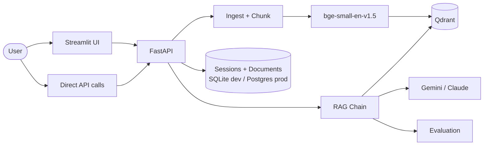

# 📚 Enterprise Knowledge Assistant

[](https://python.org)
[](https://fastapi.tiangolo.com)
[](https://qdrant.tech)
[](https://ai.google.dev)
[](tests/)
[](LICENSE)

> Production-style Retrieval-Augmented Generation: document ingestion, cited
> chat over your own documents, and a rigorous evaluation suite — not just
> another RAG demo. Most portfolios stop at retrieval + generation; this one
> also measures whether the answers are actually good.

Full docs: [Architecture](docs/ARCHITECTURE.md) · [Evaluation](docs/EVALUATION.md) · [Deployment](docs/DEPLOYMENT.md)

---

## Table of Contents
- [Features](#features)
- [Architecture](#architecture)
- [Tech Stack](#tech-stack)
- [Quick Start](#quick-start)
- [API Reference](#api-reference)
- [Evaluation](#evaluation)
- [Running Tests](#running-tests)
- [Project Structure](#project-structure)
- [Future Improvements](#future-improvements)

---

## Features

- **Multi-format ingestion** — PDF (page-tracked), Markdown, plain text
- **Cited chat** — every answer references the specific document, page, and chunk it came from, with a relevance score
- **Conversation memory** — session-aware, persisted in Postgres (prod) or SQLite (dev)
- **Rigorous evaluation** — faithfulness, answer relevancy, context precision, context recall, latency, and token-cost tracking, following the [RAGAS methodology](https://docs.ragas.io)
- **Dual LLM provider support** — Google Gemini or Anthropic Claude, same abstraction used in [ai-resume-matcher](https://github.com/vishnu0529/ai-resume-matcher)
- **Local-first dev, production-shaped deploy** — runs with zero external services locally (embedded Qdrant, SQLite); `docker-compose` wires a real Qdrant + Postgres for a production-shaped stack, same code either way
- **Actually-working Docker + CI** — a real `Dockerfile`, `docker-compose.yml`, and GitHub Actions workflow (lint → test → docker build), not placeholders

## Architecture



Full component breakdown and design decisions: [docs/ARCHITECTURE.md](docs/ARCHITECTURE.md).

## Tech Stack

| Layer | Choice |
|---|---|
| Backend | FastAPI, Pydantic |
| RAG orchestration | LangChain (text splitting), custom retrieval/generation chain |
| Vector store | Qdrant (embedded locally, real service via Docker) |
| Embeddings | `BAAI/bge-small-en-v1.5` (local, free, no API cost) |
| LLMs | Google Gemini / Anthropic Claude |
| Session storage | SQLModel — SQLite (dev) / PostgreSQL (prod) |
| Evaluation | RAGAS-methodology metrics, implemented directly (see [docs/EVALUATION.md](docs/EVALUATION.md)) |
| Demo UI | Streamlit |
| Testing | pytest, 22 tests, all mocked (no network/model load in CI) |
| Lint/format | ruff |
| Containers | Docker, docker-compose |
| CI | GitHub Actions (lint → test → docker build) |

## Quick Start

```bash
git clone https://github.com/vishnu0529/enterprise-rag-assistant.git
cd enterprise-rag-assistant

python3.11 -m venv venv
source venv/bin/activate
pip install -r requirements.txt

cp .env.example .env
# edit .env and set GOOGLE_API_KEY (or ANTHROPIC_API_KEY + LLM_PROVIDER=anthropic)

uvicorn app.main:app --reload
```

In a second terminal:

```bash
streamlit run dashboard.py
```

Or with Docker Compose (real Qdrant + Postgres, see [docs/DEPLOYMENT.md](docs/DEPLOYMENT.md)):

```bash
export GOOGLE_API_KEY=...
docker compose up --build
```

## API Reference

| Method | Path | Description |
|---|---|---|
| `GET` | `/health` | Liveness check |
| `POST` | `/documents` | Upload a PDF/Markdown/txt file, chunk + embed it |
| `GET` | `/documents` | List ingested documents |
| `DELETE` | `/documents/{id}` | Remove a document and its vectors |
| `POST` | `/chat` | Ask a question; returns answer + citations + latency/token metrics |
| `GET` | `/chat/{session_id}/history` | Retrieve a conversation's history |
| `POST` | `/evaluate` | Score a single question/answer against retrieved context |

Interactive docs at `/docs` once the server is running.

## Evaluation

Four RAGAS-methodology metrics, run against a fixed 4-question eval set over
`sample_docs/company_handbook.md` via `python scripts/run_evaluation.py`.

**Current status:** metric logic is fully unit-tested (22/22 passing,
including known-hallucination and judge-failure cases) and the whole
pipeline was verified end-to-end with a mocked LLM. A live run against this
project's own Gemini key currently hits a `429` free-tier quota limit
(`limit: 0` requests/day — an account configuration issue, not a code bug).
Full details, the exact error, and the eval set: **[docs/EVALUATION.md](docs/EVALUATION.md)**.

## Running Tests

```bash
pytest -q          # 22 tests, ~15s, no network/model download required
ruff check .        # lint
ruff format --check .  # formatting
```

## Project Structure

```
enterprise-rag-assistant/
  app/
    core/         # config, db engine
    models/       # SQLModel tables + Pydantic API schemas
    services/      # ingestion, embeddings, vector_store, rag_chain,
                   # llm_client, session_store, evaluation
    routers/       # documents, chat, evaluate
    main.py
  scripts/
    run_evaluation.py
  tests/
  docs/
    ARCHITECTURE.md
    EVALUATION.md
    DEPLOYMENT.md
  dashboard.py     # Streamlit demo UI
  Dockerfile
  docker-compose.yml
  .github/workflows/ci.yml
```

## Future Improvements

Deliberately deferred to keep this round's scope real and fully verified
rather than partially built everywhere:

- **Next.js/TypeScript frontend** (currently a Streamlit demo UI)
- **Word document and web-page ingestion** (currently PDF/Markdown/txt)
- **Streaming chat responses**
- **Hybrid search** (BM25 + vector) and **reranking**
- **Parent-document retrieval** and **query expansion**
- **Multi-agent workflow** and **MCP tool support**
- **Live cloud deployment** (Railway/Render, matching `ai-resume-matcher`) and a portfolio domain

## License

[MIT](LICENSE)
