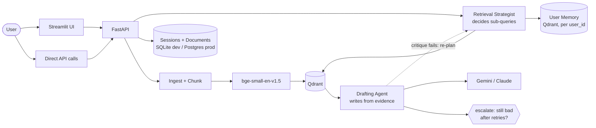

# 📋 Proposal Response Assistant

[](https://python.org)
[](https://fastapi.tiangolo.com)
[](https://qdrant.tech)
[](https://ai.google.dev)
[](tests/)
[](docs/EVALUATION.md#golden-set-50-items-including-12-deliberate-traps)
[](LICENSE)

> Production-style Retrieval-Augmented Generation for a professional-services
> bid team: drafts answers to RFP and proposal questions from a firm's own
> capability statement, past proposals, team credentials, rate card, and
> standard terms, every claim cited back to a source — and a rigorous
> evaluation suite, not just another RAG demo. Most portfolios stop at
> retrieval + generation; this one also measures whether the answers are
> actually good, and refuses to answer what the corpus doesn't support.

**Live demo:** [Streamlit dashboard](https://enterprise-rag-assistant-iyq9apbv2jeyby3xxqx3ce.streamlit.app/) · backend on Render (see [docs/DEPLOYMENT.md](docs/DEPLOYMENT.md) for how both are wired together, including a shared API-key gate — the demo only holds the synthetic `sample_docs/proposal_corpus/` documents, never a real client's).

Full docs: [Architecture](docs/ARCHITECTURE.md) · [Evaluation](docs/EVALUATION.md) · [Deployment](docs/DEPLOYMENT.md) · [Agent Production Readiness Scorecard](https://claude.ai/code/artifact/5c6af602-27b4-4bc1-af7b-c2cb501da89c) (this repo scored against all 15 items)

---

## Case Study: From Demo to Production-Shaped

This started as a generic single-document Q&A demo (`sample_docs/company_handbook.md`,
an employee handbook, no domain, no hardening). The table below is what actually
changed converting it into a bid-team proposal-response tool — every number is
either a live command you can rerun (`pytest -q`, `git diff --stat`) or a
`git show` against the exact pre-hardening commit (`968144b`), not an estimate.

| | Before (`968144b`) | Now (`HEAD`) |
|---|---|---|
| Corpus | 1 generic document, 2 chunks | 7 domain documents (capability statement, 2 past proposals, case studies, CVs, rate card, terms), 33 chunks |
| Tests | 31 passing | 50 passing (+19) |
| CI jobs | 3 (`lint`, `test`, `docker-build`) | 5 (+ `eval-gate`, `publish-eval-metrics`) |
| Hallucination testing | None | 50-item golden set: 38 answerable + 12 deliberate refusal traps |
| Citation enforcement | None — an uncited answer was indistinguishable from a cited one | `critique_node` retries, then escalates, any answer missing a `[Source N]` marker |
| Escalation on low confidence | None — a low-faithfulness answer after retries was returned exactly like a good one | Visible "needs bid-director review" banner + `escalated: true` on the response |
| Data-boundary control | None — [a real tuition-payment letter with bank details reached the public demo](docs/DEPLOYMENT.md) and had to be manually deleted | Ingestion scans for UK sort codes/account numbers/NI numbers and rejects by default (`DATA_BOUNDARY_MODE=block`) |
| Recovery from a bad state | Manual reconstruction | `scripts/rollback.py [git-ref]` — one command, verified against both the working tree and a specific past commit |

Scale: 4 commits, 33 files touched, +1,545/-95 lines since `968144b`
(`git diff --stat 968144b HEAD`).

**What's not in this table yet, on purpose:** live faithfulness/relevancy/context-recall
scores, golden-set pass rate, p95 latency, and per-task cost all require a real
LLM API call, and this project's own key is currently quota-limited (see
[docs/EVALUATION.md](docs/EVALUATION.md)) — the badge and chart there read
"pending live run" rather than a made-up number. Standing rule for this repo:
if it isn't measured, it doesn't go in the README.

---

## Table of Contents
- [Case Study](#case-study-from-demo-to-production-shaped)
- [Features](#features)
- [Architecture](#architecture)
- [Tech Stack](#tech-stack)
- [Quick Start](#quick-start)
- [API Reference](#api-reference)
- [Evaluation](#evaluation)
- [Running Tests](#running-tests)
- [Production Hardening](#production-hardening)
- [Project Structure](#project-structure)
- [Future Improvements](#future-improvements)

---

## Features

- **Multi-format ingestion**: PDF (page-tracked), Markdown, plain text
- **Cited chat**: every answer references the specific document, page, and chunk it came from, with a relevance score
- **Two-agent corrective RAG**: a Retrieval Strategist agent decides *how* to search (including real multi-hop decomposition into several sub-queries for comparison-style questions), a separate Drafting Agent writes the answer from whatever evidence it's given — they never see each other's prompts, only shared graph state. A critique node scores faithfulness *and* checks that the answer actually cites a source, and if either check fails, sends the Strategist back to re-plan (capped), instead of just returning a possibly-hallucinated or uncited answer
- **Escalation instead of silent degradation**: if retries run out and the answer is still ungrounded or uncited, it's flagged with a visible "needs bid-director review" banner and `escalated: true` in the API response — a low-confidence answer never looks the same as a good one. A genuine refusal ("the corpus doesn't cover this") is correctly exempted from the citation check
- **Cross-session memory**: optional `user_id` lets the agent semantically recall relevant exchanges from a *different*, earlier session — not just the current conversation's history
- **Conversation memory**: session-aware, persisted in Postgres (prod) or SQLite (dev)
- **Rigorous evaluation**: faithfulness, answer relevancy, context precision, context recall, latency, and token-cost tracking, following the [RAGAS methodology](https://docs.ragas.io) — scored against the same corrective-RAG graph `/chat` uses, not a separate simplified path
- **Dual LLM provider support**: Google Gemini or Anthropic Claude, same abstraction used in [ai-resume-matcher](https://github.com/vishnu0529/ai-resume-matcher)
- **Local-first dev, production-shaped deploy**: runs with zero external services locally (embedded Qdrant, SQLite); `docker-compose` wires a real Qdrant + Postgres for a production-shaped stack, same code either way
- **Actually-working Docker + CI**: a real `Dockerfile`, `docker-compose.yml`, and GitHub Actions workflow (lint → test → docker build), not placeholders

## Architecture


```mermaid
flowchart LR
    U([User]) --> UI[Streamlit UI]
    U --> API_direct[Direct API calls]
    UI --> API[FastAPI]
    API_direct --> API
    API --> Ingest[Ingest + Chunk]
    Ingest --> Embed[bge-small-en-v1.5]
    Embed --> Qdrant[(Qdrant)]
    API --> Strategist[Retrieval Strategist<br/>decides sub-queries]
    Strategist --> Qdrant
    Qdrant --> Drafter[Drafting Agent<br/>writes from evidence]
    Drafter --> LLM[Gemini / Claude]
    Drafter -.critique fails: re-plan.-> Strategist
    Drafter --> Escalate{{escalate: still bad<br/>after retries?}}
    Strategist --> Memory[(User Memory<br/>Qdrant, per user_id)]
    API --> DB[(Sessions + Documents<br/>SQLite dev / Postgres prod)]
```

The chat path is `app/services/rag_graph.py`: recall memory → **strategize** (Retrieval
Strategist decides sub-queries + top_k) → retrieve → **draft** (Drafting Agent writes the
answer) → critique (faithfulness + citation check) → (send the Strategist back to re-plan if
ungrounded or uncited, capped at 2 retries) → **escalate** (flags the answer for human review if
still bad) → remember. Full component breakdown and design decisions:
[docs/ARCHITECTURE.md](docs/ARCHITECTURE.md).

## Tech Stack

| Layer | Choice |
|---|---|
| Backend | FastAPI, Pydantic |
| Agent orchestration | LangGraph — two agent roles (Retrieval Strategist, Drafting Agent) plus a faithfulness-gated critique node that routes retries back to the Strategist |
| RAG primitives | LangChain (text splitting), custom retrieval/generation chain reused by the graph |
| Vector store | Qdrant (embedded locally, real service via Docker) — separate collections for document chunks and cross-session user memory |
| Embeddings | `BAAI/bge-small-en-v1.5` via `fastembed`/ONNX Runtime (local, free, no API cost, no torch) |
| LLMs | Google Gemini / Anthropic Claude |
| Session storage | SQLModel: SQLite (dev) / PostgreSQL (prod) |
| Evaluation | RAGAS-methodology metrics, implemented directly, scored against the real two-agent graph (see [docs/EVALUATION.md](docs/EVALUATION.md)) |
| Demo UI | Streamlit |
| Testing | pytest, 50 tests, all mocked (no network/model load in CI) |
| Lint/format | ruff |
| Containers | Docker, docker-compose |
| CI | GitHub Actions (lint → test → docker build) |

## Quick Start

```bash
git clone https://github.com/vishnu0529/enterprise-rag-assistant.git
cd enterprise-rag-assistant

python3.11 -m venv venv
source venv/bin/activate
pip install -r requirements.txt

cp .env.example .env
# edit .env and set GOOGLE_API_KEY (or ANTHROPIC_API_KEY + LLM_PROVIDER=anthropic)

uvicorn app.main:app --reload
```

In a second terminal:

```bash
streamlit run dashboard.py
```

Or with Docker Compose (real Qdrant + Postgres, see [docs/DEPLOYMENT.md](docs/DEPLOYMENT.md)):

```bash
export GOOGLE_API_KEY=...
docker compose up --build
```

## API Reference

| Method | Path | Description |
|---|---|---|
| `GET` | `/health` | Liveness check |
| `POST` | `/documents` | Upload a PDF/Markdown/txt file, chunk + embed it |
| `GET` | `/documents` | List ingested documents |
| `DELETE` | `/documents/{id}` | Remove a document and its vectors |
| `POST` | `/chat` | Ask a question (optionally with `user_id` for cross-session memory); returns answer + citations + latency/token metrics + faithfulness score + retry count + `escalated` flag + the Strategist's sub-queries/reasoning |
| `GET` | `/chat/{session_id}/history` | Retrieve a conversation's history |
| `POST` | `/evaluate` | Score a single question/answer against retrieved context |

Interactive docs at `/docs` once the server is running.

## Evaluation

Four RAGAS-methodology metrics, run against a fixed 6-question eval set over
`sample_docs/proposal_corpus/` via `python scripts/run_evaluation.py`. A
larger 50-item golden set (`eval/golden_set.json`) goes further: 38
answerable questions plus 12 deliberate traps — questions phrased like real
RFP questions but asking for facts the corpus doesn't contain — where a
correct refusal counts as a pass and a fabricated answer counts as a
failure. See [docs/EVALUATION.md](docs/EVALUATION.md#golden-set-50-items-including-12-deliberate-traps)
for how to run it.

**Current status:** metric logic is fully unit-tested (50/50 passing,
including known-hallucination and judge-failure cases, the retry/cap/memory
loop, and multi-hop sub-query merging/deduplication) and the whole pipeline
was verified end-to-end with a mocked LLM. A live run against this project's
own Gemini key currently hits a `429` free-tier quota limit (`limit: 0`
requests/day, an account configuration issue, not a code bug). Full details,
the exact error, and the eval set: **[docs/EVALUATION.md](docs/EVALUATION.md)**.

## Running Tests

```bash
pytest -q          # 50 tests, ~15s (after first model download), no network required
ruff check .        # lint
ruff format --check .  # formatting
```

## Production Hardening

The four things pilots typically skip — demonstrated in code and tests, not
just described here:

| Scorecard item | What it is | Where |
|---|---|---|
| **Escalation on low confidence** | If the critique loop exhausts its retries and the answer is still ungrounded or uncited, a visible "needs bid-director review" banner is prepended and `escalated: true` is set on the response — a low-confidence answer is never indistinguishable from a good one. | `escalate_node` in `app/services/rag_graph.py`; `tests/test_rag_graph.py::test_escalation_banner_added_*` |
| **Citation enforcement** | The critique node checks every drafted answer for a `[Source N]` marker, not just faithfulness — an answer with no citation is treated as ungrounded and retried, same as a low faithfulness score. A genuine refusal is correctly exempted (it has nothing to cite). | `critique_node`/`_CITATION_MARKER` in `app/services/rag_graph.py`; `tests/test_rag_graph.py::test_missing_citation_triggers_a_retry*`, `test_refusal_answers_are_not_flagged*` |
| **Data-boundary config** | Document ingestion is scanned for patterns that look like real personal/financial data (UK sort codes, account numbers, National Insurance numbers) and rejected by default — this is the control that would have caught [the real incident already on record](docs/DEPLOYMENT.md) where a tuition-payment letter with bank details reached the public demo. Configurable via `DATA_BOUNDARY_MODE` (`block` / `warn` / `off`). | `app/services/data_boundary.py`; `tests/test_data_boundary.py` |
| **One-command rollback** | `scripts/rollback.py [git-ref]` wipes the vector store and documents table, then re-ingests the corpus from the current working tree or a specific past commit — restoring a known-good state in a single command instead of hand-reconstructing what was ingested. | `scripts/rollback.py`, `vector_store.reset_collection()` |

## Project Structure

```
enterprise-rag-assistant/
  app/
    core/         # config, db engine
    models/       # SQLModel tables + Pydantic API schemas
    services/      # ingestion, embeddings, vector_store, rag_chain, rag_graph,
                   # agent_state, memory_store, llm_client, session_store, evaluation
    routers/       # documents, chat, evaluate
    main.py
  scripts/
    run_evaluation.py
  tests/
  docs/
    ARCHITECTURE.md
    EVALUATION.md
    DEPLOYMENT.md
  dashboard.py     # Streamlit demo UI
  Dockerfile
  docker-compose.yml
  .github/workflows/ci.yml
```

## Future Improvements

Deliberately deferred to keep this round's scope real and fully verified
rather than partially built everywhere:

- **Next.js/TypeScript frontend** (currently a Streamlit demo UI)
- **Word document and web-page ingestion** (currently PDF/Markdown/txt)
- **Streaming chat responses**
- **Hybrid search** (BM25 + vector) and **reranking**
- **Parent-document retrieval**
- **MCP tool support**
- **A portfolio domain** for the live demo (currently on Render/Streamlit Cloud's default subdomains)

## License

[MIT](LICENSE)
