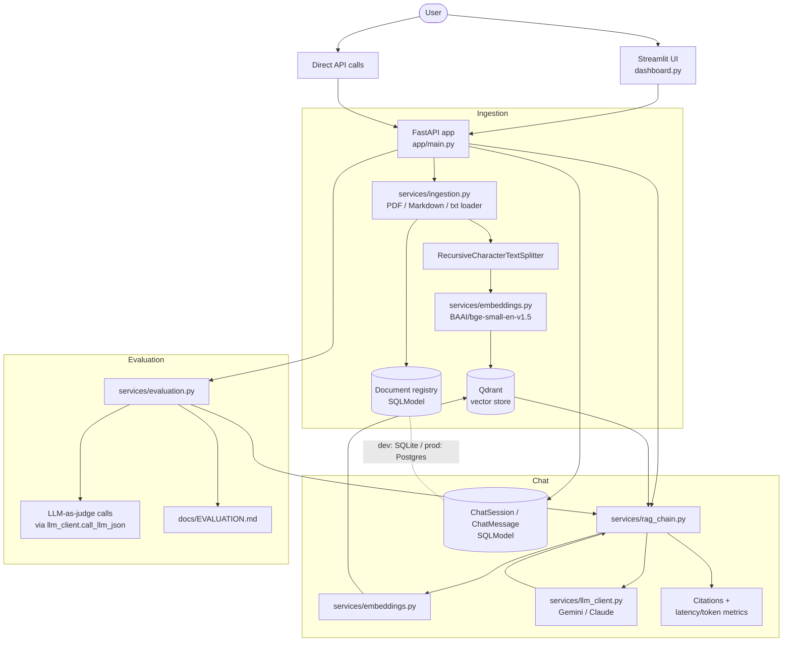

# Architecture

## Overview

## Component responsibilities

| Component | File(s) | Responsibility |
|---|---|---|
| Ingestion | `app/services/ingestion.py` | Load PDF (page-tracked)/Markdown/txt, chunk with overlap |
| Embeddings | `app/services/embeddings.py` | Local `BAAI/bge-small-en-v1.5` via `sentence-transformers` — no per-call API cost |
| Vector store | `app/services/vector_store.py` | Qdrant: embedded local mode (dev) or a real Qdrant service via `QDRANT_URL` (prod) |
| RAG chain | `app/services/rag_chain.py` | Retrieval → context assembly → generation → citation assembly, with latency/token tracking |
| LLM client | `app/services/llm_client.py` | Dual-provider (Gemini/Claude) abstraction, ported from `ai-resume-matcher` |
| Session memory | `app/services/session_store.py`, `app/models/schemas.py` | Conversation history persisted per session (SQLModel: SQLite dev / Postgres prod) |
| Evaluation | `app/services/evaluation.py` | Faithfulness, answer relevancy, context precision/recall — implemented directly (see that file's docstring for why, not via the `ragas` package) |

## Design decisions worth calling out

- **Environment-parity via config, not hardcoding.** Dev mode needs zero external services: Qdrant runs embedded (`qdrant-client`'s local mode) and sessions persist to a SQLite file. Setting `QDRANT_URL` and `DATABASE_URL` (as `docker-compose.yml` does) switches to a real Qdrant service and Postgres — same code path, no branching.
- **Citations are structural, not an afterthought.** Every retrieved chunk carries `document_id`, `filename`, `page`, `chunk_index`, and `score` all the way through to the API response, so an answer can always be traced back to its source.
- **Evaluation reuses the exact same RAG chain** the chat endpoint uses (`answer_question`) — the eval metrics score real production behavior, not a separate code path.
