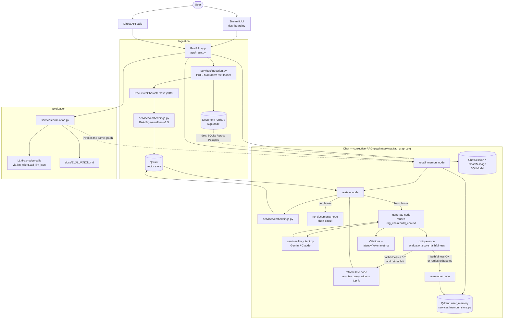

# Architecture

## Overview

## Component responsibilities

| Component | File(s) | Responsibility |
|---|---|---|
| Ingestion | `app/services/ingestion.py` | Load PDF (page-tracked)/Markdown/txt, chunk with overlap |
| Embeddings | `app/services/embeddings.py` | Local `BAAI/bge-small-en-v1.5` via `sentence-transformers` — no per-call API cost |
| Vector store | `app/services/vector_store.py` | Qdrant: embedded local mode (dev) or a real Qdrant service via `QDRANT_URL` (prod) |
| RAG chain (primitives) | `app/services/rag_chain.py` | `build_context`/`SYSTEM_PROMPT` reused by the graph; `answer_question` (single-pass) kept for its own tests, no longer the `/chat` path |
| Corrective-RAG graph | `app/services/rag_graph.py`, `app/services/agent_state.py` | LangGraph: recall memory → retrieve → generate → critique → (reformulate + retry, capped) → remember. This is the actual `/chat` and `/evaluate` path |
| Cross-session memory | `app/services/memory_store.py` | Second Qdrant collection (`user_memory`), keyed by caller-supplied `user_id`, embeds and recalls past Q&A pairs across unrelated sessions |
| LLM client | `app/services/llm_client.py` | Dual-provider (Gemini/Claude) abstraction, ported from `ai-resume-matcher` |
| Session memory | `app/services/session_store.py`, `app/models/schemas.py` | Conversation history persisted per session (SQLModel: SQLite dev / Postgres prod) |
| Evaluation | `app/services/evaluation.py` | Faithfulness, answer relevancy, context precision/recall — implemented directly (see that file's docstring for why, not via the `ragas` package); scores the graph's actual output, reusing its faithfulness score rather than recomputing it |

## Design decisions worth calling out

- **Corrective RAG, not a single-pass chain.** The old `answer_question` trusted whatever the first retrieval returned. `rag_graph.py` adds a critique node that scores the generated answer's faithfulness to the retrieved context (reusing the same judge logic evaluation.py already used offline) and, if it's ungrounded, reformulates the query and retries — up to `DEFAULT_MAX_RETRIES` (2) times before returning its best attempt rather than looping forever.
- **Cross-session memory is a separate mechanism from LangGraph's own checkpointing.** The graph is compiled with an in-memory `MemorySaver` purely so one request's retrieve/generate/critique loop can be invoked consistently; it does not persist between separate `/chat` calls. Actual cross-session recall (a later, unrelated session semantically recalling an earlier one) is handled explicitly by `memory_store.py` against a second Qdrant collection, keyed by `user_id` — a deliberate choice, since LangGraph's thread-scoped checkpointing isn't designed for semantic recall across unrelated threads.
- **Evaluation stays honest about what it's measuring.** `evaluate_question()` calls the same `answer_question_agentic` the `/chat` router calls — not a separate, simpler path — so the eval metrics reflect real production behaviour, including retries. (`evaluation.py` imports `rag_graph` lazily, inside the function, to avoid a circular import — `rag_graph`'s critique node imports `score_faithfulness` from `evaluation` at module level.)
- **Environment-parity via config, not hardcoding.** Dev mode needs zero external services: Qdrant runs embedded (`qdrant-client`'s local mode) and sessions persist to a SQLite file. Setting `QDRANT_URL` and `DATABASE_URL` (as `docker-compose.yml` does) switches to a real Qdrant service and Postgres — same code path, no branching.
- **Citations are structural, not an afterthought.** Every retrieved chunk carries `document_id`, `filename`, `page`, `chunk_index`, and `score` all the way through to the API response, so an answer can always be traced back to its source.
- **Evaluation reuses the exact same RAG chain** the chat endpoint uses (`answer_question`) — the eval metrics score real production behavior, not a separate code path.
