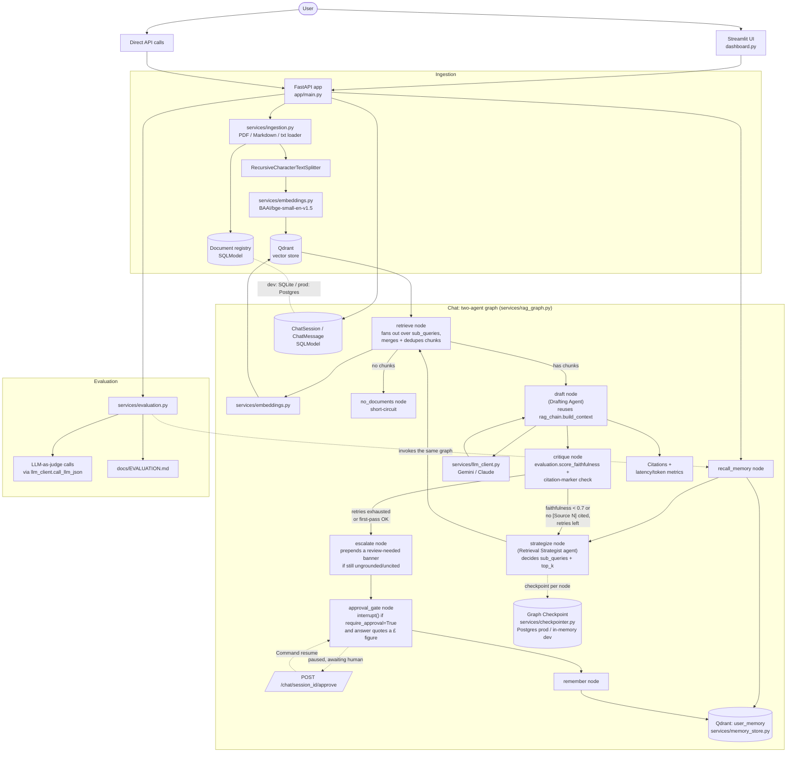

# Architecture

## Overview

```mermaid
flowchart TD
    User([User]) --> UI[Streamlit UI<br/>dashboard.py]
    User --> API_direct[Direct API calls]
    UI --> API[FastAPI app<br/>app/main.py]
    API_direct --> API

    subgraph Ingestion
        API --> Ingest[services/ingestion.py<br/>PDF / Markdown / txt loader]
        Ingest --> Chunk[RecursiveCharacterTextSplitter]
        Chunk --> Embed1[services/embeddings.py<br/>BAAI/bge-small-en-v1.5]
        Embed1 --> Qdrant[(Qdrant<br/>vector store)]
        Ingest --> DocDB[(Document registry<br/>SQLModel)]
    end

    subgraph "Chat: two-agent graph (services/rag_graph.py)"
        API --> RecallMem[recall_memory node]
        RecallMem --> UserMem[(Qdrant: user_memory<br/>services/memory_store.py)]
        RecallMem --> Strategize["strategize node<br/>(Retrieval Strategist agent)<br/>decides sub_queries + top_k"]
        Strategize --> Retrieve["retrieve node<br/>fans out over sub_queries,<br/>merges + dedupes chunks"]
        Retrieve --> Embed2[services/embeddings.py]
        Embed2 --> Qdrant
        Qdrant --> Retrieve
        Retrieve -->|no chunks| NoDocs[no_documents node<br/>short-circuit]
        Retrieve -->|has chunks| Draft["draft node<br/>(Drafting Agent)<br/>reuses rag_chain.build_context"]
        Draft --> LLM[services/llm_client.py<br/>Gemini / Claude]
        LLM --> Draft
        Draft --> Critique["critique node<br/>evaluation.score_faithfulness +<br/>citation-marker check"]
        Critique -->|"faithfulness < 0.7 or<br/>no [Source N] cited,<br/>retries left"| Strategize
        Critique -->|retries exhausted<br/>or first-pass OK| Escalate["escalate node<br/>prepends a review-needed banner<br/>if still ungrounded/uncited"]
        Escalate --> ApprovalGate["approval_gate node<br/>interrupt() if require_approval=True<br/>and answer quotes a £ figure"]
        ApprovalGate -.paused, awaiting human.-> HumanDecision[/POST /chat/session_id/approve/]
        HumanDecision -.Command resume.-> ApprovalGate
        ApprovalGate --> Remember[remember node]
        Remember --> UserMem
        Strategize -.checkpoint per node.-> Checkpoint[(Graph Checkpoint<br/>services/checkpointer.py<br/>Postgres prod / in-memory dev)]
        Draft --> Citations[Citations +<br/>latency/token metrics]
        API --> SessionDB[(ChatSession / ChatMessage<br/>SQLModel)]
    end

    subgraph Evaluation
        API --> Eval[services/evaluation.py]
        Eval -.->|invokes the same graph| RecallMem
        Eval --> Judge[LLM-as-judge calls<br/>via llm_client.call_llm_json]
        Eval --> EvalReport[docs/EVALUATION.md]
    end

    DocDB -.dev: SQLite / prod: Postgres.- SessionDB
```

## Component responsibilities

| Component | File(s) | Responsibility |
|---|---|---|
| Ingestion | `app/services/ingestion.py` | Load PDF (page-tracked)/Markdown/txt, chunk with overlap |
| Embeddings | `app/services/embeddings.py` | Local `BAAI/bge-small-en-v1.5` via `fastembed` (ONNX Runtime, no torch), so no per-call API cost, and light enough to run on Render's free tier |
| Vector store | `app/services/vector_store.py` | Qdrant: embedded local mode (dev) or a real Qdrant service via `QDRANT_URL` (prod) |
| RAG chain (primitives) | `app/services/rag_chain.py` | `build_context`/`SYSTEM_PROMPT` reused by the Drafting Agent; `answer_question` (single-pass) kept for its own tests, no longer the `/chat` path |
| Two-agent graph | `app/services/rag_graph.py`, `app/services/agent_state.py` | LangGraph, two distinct agent roles: **Retrieval Strategist** (`strategize_node`) decides sub-queries/top_k, **Drafting Agent** (`draft_node`) writes the answer from whatever was retrieved. Neither sees the other's prompt. They only share `RagAgentState`. Flow: recall memory → strategize → retrieve (fan out + dedupe) → draft → critique (faithfulness + citation check) → (send Strategist back to re-plan, capped) → escalate (flags the answer for human review if still ungrounded/uncited) → approval_gate (pauses via `interrupt()` if opted in and the answer is commercially sensitive) → remember. This is the actual `/chat` and `/evaluate` path |
| Human-in-the-loop approval | `approval_gate_node` in `app/services/rag_graph.py`, `POST /chat/{session_id}/approve` | Opt-in (`require_approval=True`). An answer quoting a specific £ figure genuinely halts the graph via LangGraph's `interrupt()`. That is a real pause backed by the checkpointer above, not a banner, and it holds until a human calls the approve endpoint with `Command(resume=...)`. Off by default; `/evaluate` and the golden set never pause |
| Durable checkpointing | `app/services/checkpointer.py` | `PostgresSaver` (prod, real `DATABASE_URL`) or `MemorySaver` (SQLite dev). `thread_id` is per session, so a killed and restarted process resumes mid-run instead of losing it. See `scripts/demo_kill_and_resume.py` for a live two-process, real-`SIGKILL` demonstration |
| Tracing | `app/core/tracing.py` | OpenTelemetry, one span per graph node (`app/services/rag_graph.py`'s `_traced` decorator) plus one parent span per request carrying cost/latency/pending-approval. Console exporter needs nothing extra (dev default); `OTEL_EXPORTER_OTLP_ENDPOINT` switches to a real OTLP backend, the same local-first-dev/production-shaped-deploy split as everything else. Verified with `tests/test_tracing.py` against OpenTelemetry's own in-memory exporter, not asserted by code inspection |
| Cost estimation | `app/core/cost.py` | Single `estimate_cost_usd()`, shared by `/chat`'s `cost_usd` field, the tracing spans, and both eval scripts. It was previously duplicated separately in each of those three places |
| Config/prompt version | `app/core/version.py` | `CODE_VERSION` resolves from `GIT_COMMIT_SHA` (deploy-time env) or `git rev-parse HEAD` (dev/CI), stamped on every `/chat` response, `/health`, and every trace's `service.version` resource attribute |
| Cross-session memory | `app/services/memory_store.py` | Second Qdrant collection (`user_memory`), keyed by caller-supplied `user_id`, embeds and recalls past Q&A pairs across unrelated sessions |
| LLM client | `app/services/llm_client.py` | Dual-provider (Gemini/Claude) abstraction, ported from `ai-resume-matcher` |
| Session memory | `app/services/session_store.py`, `app/models/schemas.py` | Conversation history persisted per session (SQLModel: SQLite dev / Postgres prod) |
| Evaluation | `app/services/evaluation.py` | Faithfulness, answer relevancy, context precision/recall, implemented directly (see that file's docstring for why, not via the `ragas` package); scores the graph's actual output, reusing its faithfulness score rather than recomputing it |

## Design decisions worth calling out

- **Two agent roles, not one function doing both jobs.** `strategize_node` (Retrieval Strategist) and `draft_node` (Drafting Agent) are separate LLM calls with separate system prompts and separate responsibilities: the Strategist never writes prose or sees retrieved text, the Drafter never decides search strategy. They communicate only through `RagAgentState` fields (`sub_queries`, `chunks`, `critique_feedback`). That is what makes it a genuine multi-agent split rather than a renamed single-pass chain.
- **The critique loop retries by re-planning, not just rewording.** A low faithfulness score, or an answer that cites no source at all, routes back to `strategize`, not to a narrow query-rewrite step, so a retry can mean a broader query, a completely different angle, or decomposing into multiple sub-queries, not just different phrasing of the same search. Capped at `DEFAULT_MAX_RETRIES` (2) so it can't loop forever.
- **Escalation, not silent degradation, when retries run out.** If the answer is still ungrounded or still uncited after the retry cap, `escalate_node` prepends a visible "needs bid-director review" banner and sets `escalated=True` on the response, so a low-confidence answer never looks identical to a good one. A correct refusal (the corpus genuinely doesn't cover the question) is explicitly exempted from the citation check via `rag_chain.is_refusal()`, so a well-behaved "I don't have enough information" is never mistaken for a missing-citation failure.
- **Human-in-the-loop is a real pause, not a UI convention.** `approval_gate_node` calls LangGraph's `interrupt()`, which raises a `GraphInterrupt` and genuinely halts execution. `graph.invoke()` returns with an `__interrupt__` key instead of a finished answer, and nothing downstream (`remember_node`, the response to the caller) runs until `POST /chat/{session_id}/approve` resumes it with `Command(resume=...)`. This only works because a checkpointer is enabled: the same `app/services/checkpointer.py` durable checkpointing above is a hard prerequisite for `interrupt()`, not a separate feature. LangGraph re-executes a node's logic from the top on every resume, so everything in `approval_gate_node` before the `interrupt()` call is a cheap, side-effect-free regex check, never an LLM call or a write.
- **Graph state avoids framework-opaque types on purpose.** `draft_node` builds `citations` as plain dicts, not `Citation` Pydantic objects, specifically because the checkpointer msgpack-serializes graph state to Postgres and an unregistered custom type there is a real forward-compatibility hazard (caught by testing against a real Postgres instance, not the mocked test suite. `MemorySaver` never serializes anything, so it couldn't have caught this). Pydantic validates the plain dict into a `Citation` automatically at the `ChatResponse` boundary, so nothing downstream needs to know the difference.
- **Multi-hop retrieval is a side effect of the Strategist having real agency.** For comparison-style questions, the Strategist can emit 2-3 sub-queries instead of one; `retrieve_node` fans out over all of them and `_merge_and_dedupe` collapses overlapping chunks (same `document_id`/`chunk_index`) down to their highest score, so multi-hop questions don't get double-counted context.
- **Two distinct memory mechanisms, deliberately not merged: short-term (graph checkpoint) vs. long-term (cross-session store).** `app/services/checkpointer.py` provides the graph's checkpointer: `PostgresSaver` when `DATABASE_URL` points at real Postgres (docker-compose, production), falling back to in-memory `MemorySaver` for local SQLite dev, the same local-first-dev/production-shaped-deploy split as `vector_store.py`. This is **short-term, thread-scoped memory**: it durably persists one `thread_id`'s (one session's) in-flight run so a killed and restarted process resumes mid-conversation instead of losing it (see `scripts/demo_kill_and_resume.py` for a live two-process, real-SIGKILL demonstration), but it is not designed for semantic recall across *different*, unrelated sessions. **Long-term, cross-session memory** is a separate mechanism: `memory_store.py` against a second Qdrant collection, keyed by `user_id`, semantically recalling relevant exchanges from earlier, unrelated sessions. Nothing is promoted automatically from one to the other. The checkpoint is infrastructure for resuming a run; `remember_exchange` (called explicitly in `remember_node`) is the only path into long-term memory, and only for the final question/answer pair of a completed run, never intermediate graph state.
- **Evaluation stays honest about what it's measuring.** `evaluate_question()` calls the same `answer_question_agentic` the `/chat` router calls, not a separate, simpler path, so the eval metrics reflect real production behaviour, including any Strategist re-planning. (`evaluation.py` imports `rag_graph` lazily, inside the function, to avoid a circular import, because `rag_graph`'s critique node imports `score_faithfulness` from `evaluation` at module level.)
- **Environment-parity via config, not hardcoding.** Dev mode needs zero external services: Qdrant runs embedded (`qdrant-client`'s local mode) and sessions persist to a SQLite file. Setting `QDRANT_URL` and `DATABASE_URL` (as `docker-compose.yml` does) switches to a real Qdrant service and Postgres. Same code path, no branching.
- **Citations are structural, not an afterthought.** Every retrieved chunk carries `document_id`, `filename`, `page`, `chunk_index`, and `score` all the way through to the API response, so an answer can always be traced back to its source.
- **Tracing wraps every node without touching LangGraph's own interrupt mechanism.** `_traced()` (`rag_graph.py`) is a decorator, not a rewrite of each node. It opens a span, calls the real node function, and records whatever the node returned. `approval_gate_node` calling `interrupt()` raises a `GraphInterrupt` *through* that span's context manager on the very first pass; OpenTelemetry's default behaviour (record the exception on the span, then re-raise) is exactly what's needed here, and it was verified directly, since a tracing layer that silently swallowed that exception would break the human-in-the-loop feature entirely, not just look wrong in a dashboard. All 6 approval-gate tests plus 5 new tracing tests pass together, not as separate claims.
- **Config/prompt version travels with every answer, without a second version number to forget to bump.** `app/core/version.py` resolves `CODE_VERSION` from `GIT_COMMIT_SHA` (set at deploy time, since `.git` usually isn't shipped in a container image) or falls back to `git rev-parse HEAD` in dev/CI. Since prompts (`SYSTEM_PROMPT`, `STRATEGIST_SYSTEM_PROMPT`) and settings live as code/env rather than a separately-versioned prompt-management system, the commit SHA genuinely *is* the prompt version. Every `ChatResponse` and `/health` carries `code_version`, so "which config produced this past answer" has an exact answer.
- **LLM calls use each vendor SDK's own retry transport, not a hand-rolled loop.** Before this, neither `_google_client()` nor `_anthropic_client()` (`app/services/llm_client.py`) set a timeout at all, so a hung connection could hang a `/chat` request indefinitely, and the only failure handling was `draft_node`'s catch-all except (see `tests/test_llm_failure_in_draft_returns_clean_message_without_retry_or_memory_write` for that degrade-not-hang proof). `LLM_TIMEOUT_SECONDS`/`LLM_MAX_RETRIES` now configure Google's `HttpRetryOptions` (exponential backoff, jittered) and Anthropic's native `timeout`/`max_retries` respectively, using the vendor's own tested backoff implementation rather than ours. `tests/test_llm_client.py` verifies the config actually reaches the constructed client object, not just that the settings fields exist.
- **This is a routing graph, not a multi-specialist supervisor pattern, and that's a deliberate call, not a gap being papered over.** There are four genuine conditional routing decisions (`_route_after_retrieve`: no-context vs draft; `_should_retry`: re-plan vs escalate; the Strategist's own 1-vs-many sub-query decomposition; `approval_gate`'s pause-or-pass-through). None of them route between *different specialist agents* the way a supervisor-of-specialists pattern does, because this corpus is single-domain (proposal responses), so there's no genuine second specialty to route to. Manufacturing a "pricing agent" and a "credentials agent" over the same seven documents just to claim a supervisor pattern would be architecture theater, not real value, and would fail the same honesty bar as the rest of this repo. `docs/graph.png` (rendered directly from the compiled graph, see `scripts/render_graph.py`) shows the real shape: five conditional branch points and a bounded retry cycle, which is genuinely non-trivial orchestration without needing to be something it isn't.
